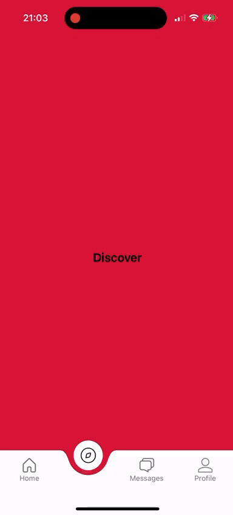

RNCircleTabBar is a [**React Native**](https://reactnative.dev) project. Custom tabBar ``<CircleAnimatedTabbar {...props} />`` component for [react-navigation](https://reactnavigation.org/).
>**Note**: Make sure you have completed the [React Native - Environment Setup](https://reactnative.dev/docs/environment-setup) instructions till "Creating a new application" step, before proceeding.



## Run Application
First, you will need to complete [React Native - Environment Setup](https://reactnative.dev/docs/environment-setup) then close the project and install dependencies using ``yarn``.
```bash
# start Metro
yarn start
# run the application(ios or android)
yarn ios | android
```

# Troubleshooting
The project does not utilize any UI scaling algorithms/libraries, so it may not adjust perfectly to devices of varying sizes. I tested the project using an iPhone 15 Pro. It simply provides an idea of how to implement it.

# Learn More

To learn more about React Native, take a look at the following resources:

- [React Native Website](https://reactnative.dev) - learn more about React Native.
- [Getting Started](https://reactnative.dev/docs/environment-setup) - an **overview** of React Native and how setup your environment.
- [Learn the Basics](https://reactnative.dev/docs/getting-started) - a **guided tour** of the React Native **basics**.
- [Blog](https://reactnative.dev/blog) - read the latest official React Native **Blog** posts.
- [`@facebook/react-native`](https://github.com/facebook/react-native) - the Open Source; GitHub **repository** for React Native.
